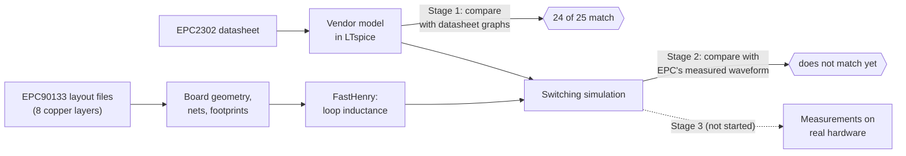
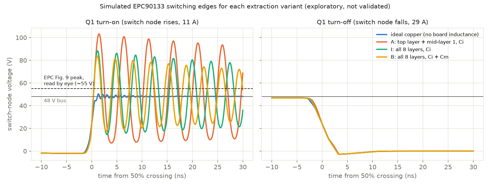

# GaNCircuit: an agent-driven GaN power-electronics pipeline

## The goal

The project is building a mostly automated way to go from a transistor's datasheet to a tested circuit
board. The transistor is the **EPC2302**, a fast power switch made from gallium nitride (GaN). The board
is EPC's **EPC90133**, which uses two of these switches to chop a 48 V supply into pulses, the basic
building block of power converters. The long-term aim is for software, with AI agents helping, to
predict how the board will behave. We then check that prediction against real measurements and use what
we learn to design a better board.

The work splits into three stages:
1. **The transistor on its own:** does our simulation of the chip behave like the datasheet says?
2. **The board:** does our simulation of the chip on its actual circuit board behave like the real board?
3. **Real measurements:** testing actual hardware safely and comparing it with the predictions.



The full plan, including its checkpoints (gates G0–G6) and safety rules, is in
[plans/gan-halfbridge-pipeline-plan.md](plans/gan-halfbridge-pipeline-plan.md).

## What we've done

### Stage 1: the transistor (mostly done)
- EPC provides a simulation model of the EPC2302. We showed it runs correctly in our circuit simulator,
  LTspice ([table comparison](results/gan/epc2302-baseline.json)).
- We compared it with 25 graphs from the datasheet. 24 match closely
  ([comparison](results/gan/epc2302-curve-comparison.json)). They match so closely that EPC probably drew them
  from the same model, so this shows our simulation runs the model faithfully, not that the model matches real parts.
- One graph doesn't match: the one showing how much electric charge it takes to switch the transistor on
  ([Fig. 7 comparison](results/gan/epc2302-fig7-comparison.json)). We haven't worked out why.
- Because of that mismatch, we don't yet trust simulated switching speeds or energy losses. The owner accepted the
  unmodified model as a provisional baseline for Stage 2 (gate G2, 28 September 2026). The model is not tuned.

### Stage 2: the board (tools built, results not trusted yet)
- **We can read the board's layout.** EPC publishes the manufacturing files: copper shapes on 8 stacked layers,
  plus about 450 drilled holes (vias) that connect the layers. Our software turns these into a map of which copper
  belongs to which part of the circuit ([geometry](results/gan/epc90133-geometry.json)). It checks that the transistors'
  pads are in the right places ([power-loop overlay](results/gan/epc90133-power-loop.json), pictures in
  `results/gan/epc90133-power-loop/`).

  

  *Top copper layer around the two transistors, drawn from EPC's files. Red is the input supply (VIN), green the switch
  node (SW), blue ground (GND). The numbered rectangles are the transistor pins; dots are vias. The arrows show the
  switching current's path: from the capacitors (top) through Q1 and Q2, then down through vias to the ground plane below.*

  

  *Side views cut through the board (height exaggerated). Each row of colour is one copper layer, and vertical bars
  are vias. The switch-node vias pass through holes in the ground layers, leaving slots in the return path.*

- **We can calculate the board's hidden effects.** Copper paths act like tiny unwanted coils (inductance). When the
  switch flips in about a nanosecond, these tiny coils cause voltage spikes and ringing. A tool called FastHenry calculates
  them from the copper shapes. We found that the deeper copper layers matter a lot (they cut the loop inductance by
  about 40 %). How the vias are represented matters less: under 2 % on the partial board, up to 7 % on the full board.
  Both figures come from the coarse mesh only; the finer-mesh board extraction has not been run. These calculations
  cover the main power loop only. The gate-drive and source-return paths are not yet extracted.
- **We can simulate the switching.** The board's calculated inductances go into the circuit simulation alongside the
  transistor models. That lets us predict the voltage waveform when the switch flips.

### What doesn't work yet
- **The prediction doesn't match EPC's measured waveform.** We now read EPC's published waveform (QSG Fig. 9) from
  its pixels with a declared method, and we report how much the reading depends on our choices. (The earlier reading
  of about 0.6 GHz was wrong: the figure is two zoomed screenshots stitched side by side.) The ringing frequency is
  close: 262–265 MHz measured against 284 MHz simulated with the full board. The spike is not: about 35 V simulated
  against 5.7 V measured. Our edge is also twice as fast (0.83 ns against 1.68 ns), and our ringing dies away about
  7 times more slowly. One screenshot pixel is 0.2 ns, so edge times can only be compared to about that precision.

  

  *EPC's measurement (black) against the simulation with the board as extracted (blue), with 50 pH added in the
  transistors' drain path (orange), with 50 pH added in the source path shared with the gate driver (green), and with
  extra loss added to damp the ringing (red). The turn-off edge (right) matches. At turn-on (left) every simulated ring
  is larger than the measured one. The shared source path (green) brings it closest without shifting the frequency much.*

  

  *Simulated switch-node voltage when the top transistor turns on (left) and off (right), for each extraction variant.
  With no board inductance (blue) the edge is almost clean. With the extracted copper, the voltage rings far above the
  48 V supply. Adding more of the board (orange → green → yellow) lowers the spike but does not reach the ~55 V peak read
  from EPC's measurement (dashed line). The turn-off edge barely depends on the layout. The dashed line is an early
  by-eye reading; the digitized peak is 51.5 V (5.7 V above a settled 45.8 V).*
- **We tested suspected missing pieces one at a time.** No single change, and no combination we tried, reproduces
  the measurement. What each test shows, within the approximation it used:
  - **A shared source path is the strongest lead so far.** When a small inductance sits in the part of the transistor's
    source path that the gate driver's return shares with the power current, it slows the switch-on and halves the
    spike (35 → 17 V at 50 pH) while the frequency stays close (250 MHz). The same inductance anywhere else in the
    power path makes things worse. Our board model doesn't yet include this shared path, neither on the board nor in
    the package, so the layout is not ruled out; it is the next thing to extract.
  - a weaker gate driver lowers the spike without moving the frequency, but not far enough;
  - extra inductance in the gate loop makes little difference;
  - adding the missing gate charge from the datasheet's gate-charge curve, as one fixed capacitor, lowers the spike a
    little. The real discrepancy depends on voltage, so this doesn't show that it is small;
  - extra loss in the capacitors can reproduce the measured damping (it needs about 60–70 mΩ in the loop, 30 times the
    copper's resistance) but barely lowers the first spike. Loss located elsewhere might behave differently;
  - a simple bandwidth limit in EPC's probe can't explain it on its own. A probe's loading, its connection point and
    its own resonances weren't tested and remain possible.

  EPC's waveform also has a shorter dead-time step than our model gives for the board's 10 ns setting. Read through our
  driver model, that suggests about 5 ns. This is an inference that depends on the model, not a measurement of the
  driver, and the similar EPC9097 result came from the same method.
- **What would settle it:** first, extract the shared source path and put it in the model. Then our own measurements
  with a known probe on a known point, designed to tell the remaining explanations apart (driver, package, losses,
  probe) and repeated at operating conditions not used for tuning.

### Stage 3: real hardware (not started)
- We have no board and have made no measurements. That comes later, with safety hardware that works independently
  of the software.

**In one sentence:** we have a working chain of tools that goes from the manufacturer's files to a predicted waveform.
Its predictions don't match reality yet, and the next job is to find out why.

## What's next

Done on 29–30 September 2026:
- the sensitivity runs: the package-inductance spikes were numerical and are removed, and a continuous-operation
  (periodic buck) run shows the simplified double-pulse test gives the same edges, on both the partial and the full
  board model;
- EPC's measured waveform, digitized with a declared method and an uncertainty range;
- the candidate causes, tested one at a time against it, and after an external review the drain, source, shared-source
  and gate paths separately (see above and the build notes, tests 5 and 6);
- the comparison code now refuses to give a verdict on any simulation that failed its own checks.

1. **Extract the shared source path.** The board copper between each transistor's source pad and the Kelvin via that
   the gate driver returns to, plus the gate-loop path, with FastHenry, and add them to the model. Test 6 shows that
   this path can change the spike by half.
2. **Plan the hardware stage in parallel.** An EPC90133 will be bought (owner decision, 30 September 2026). The lab
   equipment for board measurements is being checked; the lab's B1506A and PD1550A are device testers, not board
   testers. A draft plan, for review, is in [docs/epc90133-hardware-test-plan.md](docs/epc90133-hardware-test-plan.md),
   with an equipment checklist. The experiments should separate the remaining explanations and include held-out
   operating conditions:
   - a known probe on a known point;
   - ringing measured at several currents and bus voltages;
   - dead time measured at the driver outputs;
   - loop inductance measured from the ringing frequency with a known added capacitor.
3. **A first bounded agent run** (a project goal, not the current priority). One reproducible run that consumes the declared inputs, checks them, produces this
   comparison and stops correctly, with interventions, failures, time and cost recorded and compared with the plain
   scripts. So far the evidence is for the tools, not yet for the agent workflow.
4. **No EPC inquiry** (owner decision, 30 September 2026). Fig. 9's probe, probing point and dead-time setting, and
   the EPC2302 package inductance, stay unknown: they are treated as assumptions or measured on our own board.
5. **Add capacitance extraction with FasterCap.** Qualify it on known answers (a parallel-plate capacitor with
   fringing, a microstrip line), then replace the rough ~135 pF switch-node estimate with an extracted value. Today's
   bench shows that estimate changes the spike by only about 1 V, so this matters more for switching losses and for our own
   board than for closing the current gap.
6. **Complete the parasitic set in the extraction interface.** The draft
   [parasitic extraction and Agent 2 stop criteria](plans/Layout%20Parasitic%20Extraction%20and%20Agent%202%20Stop%20Criteria.docx),
   adopted with corrections in the [plan](plans/gan-halfbridge-pipeline-plan.md), lists seven "must" parasitics.
   The power-loop three (L_d, L_sw, L_s) are extracted. Common-source inductance, the two gate-loop inductances and
   switch-node capacitance are not yet extracted. The values go into one `parasitics.inc` file that the simulation reads,
   with the coupling between segments kept.
7. **Later:** our own board layout in KiCad, with predictions frozen before fabrication and scored against measurements.

Gate G3 (stock-board simulation) stays open until the gap with the measurement is explained or bounded.

## Tools

| Tool | What it does here | Status |
|---|---|---|
| Python 3.10+ with numpy, scipy, Pillow, matplotlib | glue, analysis, geometry, plots | in use |
| `circuit_tools` (this repo, `src/`) | runner interface, artifact store, LTspice adapter, Gerber reader | in use; 95 tests |
| **LTspice 26.1.1** | circuit simulation of the vendor model and board (batch mode on Windows) | qualified (gate G1) |
| **FastHenry 3.0.1** | inductance/resistance extraction from copper geometry (under WSL) | qualified for bars and plane pairs; board use exploratory. Internal-only use; not redistributed (licence note below) |
| PyMuPDF | reads datasheets and digitizes their graphs | in use |
| openpyxl, xlrd | read EPC's BOM and stackup files | in use |
| DEVSIM | device simulator for the paused silicon NMOS fixture (WSL) | paused |
| **FasterCap** | capacitance extraction between conductors (switch-node, VIN and GND copper), the companion to FastHenry | planned, not installed; LGPL 2.1+ per its README, [source](https://github.com/ediloren/FasterCap). Must pass known-answer checks before board use |
| KiCad | our own board design (Stage 2, later) | not installed |
| PSpice, Spectre | alternative simulators | not installed; ngspice was removed |

EPC files, papers and FastHenry itself are not in git: they live in the git-ignored `vendor/` and `.tools/`,
with sources, dates and checksums recorded in `devices/`. FastHenry's MIT-authored notice is restrictive and is not the
standard MIT License; internal use was confirmed by the owner (commit `95b0fad`).

## Repository layout

- `src/circuit_tools/`: the library (LTspice adapter, Gerber/drill reader, revisions, artifacts, CLI).
- `scripts/`: one script per study, each with its specification in its docstring (for example
  `epc2302_baseline.py`, `read_epc90133_geometry.py`, `epc90133_power_loop.py`, `epc90133_extract.py`,
  `epc90133_switching.py`).
- `devices/`: source records (URLs, dates, checksums, terms) and transcribed schematics.
- `results/`: committed result reports; failed runs are kept alongside with `-failed` in the name.
- `docs/`: [build and replay notes](docs/build.md), [literature notes](docs/gan-layout-literature-notes.md),
  [benchmark sources](docs/device-benchmark-sources.md), [workflow review](docs/gan-workflow-methods-review.md).
- `plans/`: the active [pipeline plan](plans/gan-halfbridge-pipeline-plan.md) and the reused toolset plan.
- `tests/`: unit and known-answer tests.
- `vendor/`, `runs/`, `.tools/`: git-ignored vendor files, simulation scratch output and local tool builds.

## How to run

```sh
PYTHONPATH=src python -m pytest -q tests                  # unit and known-answer tests
PYTHONPATH=src python scripts/verify_ltspice_fixtures.py  # LTspice adapter checks
PYTHONPATH=src python scripts/epc2302_baseline.py         # Stage 1: model vs datasheet table
PYTHONPATH=src python scripts/epc90133_power_loop.py      # Stage 2: board geometry, footprints, ports
PYTHONPATH=src python scripts/epc90133_extract.py B:m1:mid --jobs 3   # FastHenry extraction (about 2 h)
PYTHONPATH=src python scripts/epc90133_switching.py       # switching sensitivity from all extractions
```

The vendor files must first be downloaded to `vendor/` as recorded in `devices/`. Details, expected results
and known limits for every command are in [docs/build.md](docs/build.md).

## Project rules

- Record the source, retrieval date, checksum and reuse terms of every vendor file.
- Keep the original vendor model as the baseline; tune it only when evidence isolates a discrepancy to the device,
  and store any tuned model separately.
- Declare checks and tolerances before running them, and keep failed runs.
- A simulated sensitivity is not a safe operating limit. Hardware protection stays independent of any AI agent.

## Detailed technical status

**Stage 1 numbers.** Every datasheet-table row with a limit is inside it. Capacitances, output charge and RDS(on)
are within 0.2–7% of typical, and total gate charge is 4% low. The gate-charge sub-values (QGD −34%, QG(TH) −31%) are
unresolved. In Fig. 7 the model's Miller plateau is 24% narrower, and its charge after the plateau is about 1.2 nC (8%) low.
Simulations keep `reltol=1e-6`: the default under-integrates gate charge. See
[build notes](docs/build.md#epc2302-datasheet-curves-g2-curve-slice).

**Board files.** BOM and Gerbers are board B5253 Rev 2.0, 8 copper layers
([audit](results/gan/epc90133-board-audit.json)). The schematic labels the driver uP1966A where the BOM says uP1966E,
and a design-folder name mentions EPC2301. Both stay recorded. A [BOM-based schematic](devices/epc/epc90133-schematic.json)
passes a static connectivity check.

**Power loop.** Two stacked loops exist: the top layer over mid-layer 1, and a second one through the lower layers to
the bottom-side Cm capacitors. The return plane under both transistors is slotted by switch-node via clearances, a case
that is not qualified.

**Via check.** The FastHenry via/plane-pair benchmark ([result](results/gan/fasthenry-via-cavity.json)) fails its
declared mesh criterion and stays recorded as failed. Only the spreading-inductance difference between two closed benchmark
cavities passed. The declared via representation uncertainty is the bracket width (23.5/33.7 pH), and it applies to the
benchmark only. The owner deferred the finer mesh on 29 September 2026.

**Extraction and switching (exploratory, interim).**

| Variant | Loop L | Rise overshoot | Ringing |
|---|---|---|---|
| A: top + mid-layer 1, Ci (three via representations) | 0.49–0.50 nH | 54.5–54.9 V | 0.20 GHz |
| I: all copper, Ci | 0.30 nH | 40.0 V | 0.27 GHz |
| B: all copper, Ci + Cm | 0.28 nH (0.27 gap, 0.26 pad via representation) | 35.7 V | 0.28 GHz |
| ideal copper | — | 2.1 V | 1.15 GHz |
| EPC's measurement (QSG Fig. 9, digitized; probe unknown) | — | 5.7 V | 0.26 GHz |

See [build notes](docs/build.md#epc90133-exploratory-extraction-and-switching-sensitivity-g3-steps-23-interim).

## History

- **EPC9097/EPC2204 (paused reference).** The first target, kept as reference evidence. The LTspice adapter was
  qualified on it, and the EPC2204 model matched all 23 datasheet curves. A switching bench swept the loop inductance
  before any extraction. EPC publishes two layout revisions of that board, and neither is linked to a physical board.
  See [build notes](docs/build.md#epc2204-vendor-model-baseline-stage-1-first-slice).
- **Silicon NMOS/DEVSIM fixture (paused).** An earlier development fixture built the reusable infrastructure: immutable
  revisions, artifact provenance, result semantics and a bounded simulator runner. Its device and results are kept. See
  [generated planar NMOS](docs/build.md#generated-planar-nmos-candidate-lc1) and the
  [co-design toolset plan](plans/autonomous-circuit-toolset-plan.md).

