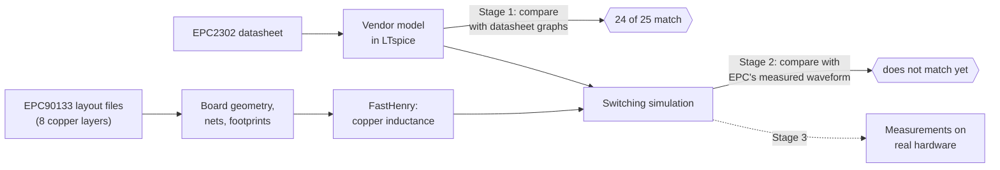
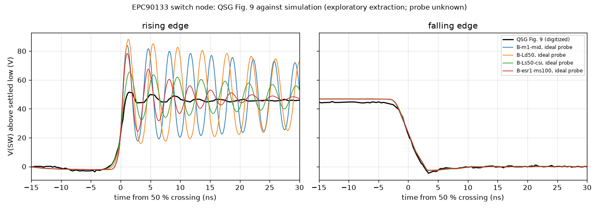

# GaNCircuit: an agent-driven GaN power-electronics pipeline

## What the project is

GaNCircuit builds a largely automated path from a power transistor's datasheet to a tested circuit board. It
has four steps:

1. Qualify the manufacturer's simulation model of the transistor.
2. Simulate the transistor on its real board, including the board copper's electrical side effects.
3. Measure the real board safely.
4. Use the gap between prediction and measurement to improve understanding and, later, the board design.

The long-term aim is for software agents to carry out much of this loop. They would work through versioned
artifacts, declared checks and recorded decisions, with humans at safety-critical points.

The subject is the **EPC2302**, a 100 V gallium-nitride (GaN) power transistor from EPC, on EPC's **EPC90133**
development board. The board is a *half-bridge*: two EPC2302s in series, driven by a uP1966E gate driver. The upper
switch (Q1) and the lower switch (Q2) take turns connecting the *switch node* to a 48 V supply or to ground. That
produces the square pulses at the heart of most power converters, such as a buck converter stepping 48 V down.

GaN transistors switch in about a nanosecond. At that speed, a few tenths of a nanohenry of stray inductance in the
board copper produce voltage spikes and ringing large enough to matter for losses, noise and device stress.
Predicting the switching waveform therefore needs both a good transistor model and a good description of the
layout.



The full plan, with its checkpoints (gates G0–G6), stage interfaces and safety rules, is in
[plans/gan-halfbridge-pipeline-plan.md](plans/gan-halfbridge-pipeline-plan.md).

## How the pipeline is organised

The work falls into three stages. Each has its own inputs, outputs and acceptance checks, so every layer of error can be
bounded with its own evidence:

| Stage | Question | Evidence it uses |
|---|---|---|
| 1. Device | Does the vendor model, run in our simulator, reproduce the datasheet? | datasheet tables and graphs |
| 2. Board | Does the model on the extracted board reproduce the board's switching waveform? | layout files, EPC's published waveform |
| 3. Measurement | Does the prediction hold on real hardware, including at conditions not used for tuning? | our own measurements |

One matching waveform cannot tell a transistor error from a layout error or a probe error. For that reason the
stages are kept separate, and the vendor model is never tuned to make a board waveform fit.

## Stage 1: the transistor model

EPC supplies an LTspice model of the EPC2302. The project runs it through its own LTspice adapter
(`src/circuit_tools/ltspice.py`). The adapter writes the test circuit, runs LTspice in batch mode, reads the waveforms
and reports failures honestly: a simulation that needed convergence fallbacks counts as failed, not as a result.

- **Datasheet table.** Every table value that has a limit falls inside it. Capacitances, output charge and on-resistance
  are within 0.2–7 % of their typical values; total gate charge is 4 % low
  ([table comparison](results/gan/epc2302-baseline.json)).
- **Datasheet graphs.** The graphs are digitized from the PDF's vector drawings, calibrated from the plot frames and grid.
  24 of 25 graphs match closely ([comparison](results/gan/epc2302-curve-comparison.json)). The match is so close that EPC
  probably drew them from the same model. That shows our simulator runs the model faithfully, not that the model matches
  real parts.
- **The exception: gate charge (Fig. 7).** The model's Miller plateau is 24 % narrower than the datasheet curve, and its
  charge after the plateau is about 1.2 nC low ([Fig. 7 comparison](results/gan/epc2302-fig7-comparison.json)). The cause
  is not known. Simulated switching times and switching losses depend on gate charge, so they are not treated as
  validated.
- **Model status.** The unmodified model is the provisional baseline for the board stage. A tuned model would be stored
  as a separate revision, and only if device-level evidence isolated the discrepancy to the transistor. Simulations use
  `reltol=1e-6`, because the default tolerance under-integrates gate charge.

## Stage 2: the board

### Reading the layout

EPC publishes the board's manufacturing files: the BOM, and Gerber and drill files for 8 copper layers with about 450 vias
([audit](results/gan/epc90133-board-audit.json)). Our Gerber reader (`src/circuit_tools/gerber.py`) rasterizes each
layer. `scripts/read_epc90133_geometry.py` then assigns copper to nets such as the input supply, switch node and ground
([geometry](results/gan/epc90133-geometry.json)). A schematic transcribed from the BOM
([devices/epc/epc90133-schematic.json](devices/epc/epc90133-schematic.json)) passes a static connectivity check.

`scripts/epc90133_power_loop.py` locates the transistor and capacitor contacts from the solder-mask and paste layers. It
checks them against the EPC2302 footprint (size, orientation, gate, source and drain pins) and defines exact electrical
ports for extraction ([power-loop overlay](results/gan/epc90133-power-loop.json)).


*Top copper layer around the two transistors, drawn from EPC's files. Red is the input supply (VIN), green the switch
node (SW), blue ground (GND). The numbered rectangles are the transistor pins; dots are vias. The arrows show the
switching current's path: from the capacitors (top) through Q1 and Q2, then down through vias to the ground plane below.*


*Side views cut through the board (height exaggerated). Each row of colour is one copper layer, and vertical bars are
vias. The switch-node vias pass through holes in the ground layers, leaving slots in the return path.*

The board has two stacked power loops. One runs on the top layer over mid-layer 1 through the input capacitors next to
the transistors (Ci). The other runs through the lower layers to capacitors on the bottom side (Cm).

`scripts/epc90133_gate_loop.py` maps the gate-drive loops the same way
([gate-loop geometry](results/gan/epc90133-gate-loop.json)). It covers:
- the driver's ball pattern;
- the gate resistors (1 Ω on turn-on, 0 Ω on turn-off);
- each transistor's gate pin;
- the source pins that the driver returns to.

### Extracting the copper's inductance

`scripts/epc90133_extract.py` turns the copper into a FastHenry model and computes the inductance and resistance of every
branch between the ports. It keeps the mutual coupling between branches in the circuit, instead of reducing the board
to one loop-inductance number. Several representations of the board are extracted, so that modelling choices show up
as sensitivities:

| Variant | Copper included | Power-loop inductance |
|---|---|---|
| A | top layer and mid-layer 1, Ci capacitors | 0.49–0.50 nH |
| I | all copper, Ci capacitors | 0.30 nH |
| B | all copper, Ci and Cm capacitors | 0.26–0.28 nH |
| G | B plus the gate-drive loops and split source pins, with a finer mesh on the top layer | in progress |

- **Deeper layers.** The deeper copper layers lower the loop inductance by about 40 %.
- **Via representation.** Three via-to-plane junction models change the result by under 2 % on A and up to 7 % on B.
- **Mesh.** Only the coarse mesh has been run on the full board, so these numbers carry no mesh-convergence evidence.
- **Qualification.** FastHenry passes known-answer checks for bars and plane pairs ([result](results/gan/fasthenry-known-answer.json)).
  The via/plane-pair benchmark ([result](results/gan/fasthenry-via-cavity.json)) fails its mesh criterion. Vias, plane
  holes and the slotted return plane under the transistors are therefore not qualified, and board extractions are
  exploratory.

### Simulating the switching

`scripts/epc90133_switching.py` combines the vendor model, a behavioural uP1966E driver calibrated to its datasheet and an
extracted board network. It runs them in a *double-pulse* test: one turn-off and one turn-on, at the same inductor
currents as EPC's published buck waveform. A continuous (periodic) buck simulation gives the same edges within 1.3 % on
A and 0.7 % on B, so the simpler test stands in for continuous operation.

Every case carries its own numerical checks:
- no single-step voltage spikes;
- a halved-time-step rerun;
- convergence without fallbacks.

Cases that fail are kept for inspection but receive no verdict. Device quantities are taken at the transistor's die
terminals and switch-node quantities at the pads.

### Comparing with EPC's measurement

The only published board measurement is EPC's switch-node waveform in the quick-start guide (QSG Fig. 9: 48 V to
13.8 V, 20 A, 250 kHz). `scripts/digitize_epc90133_qsg_fig9.py` reads it from the screenshot pixels with a declared
method and reports how much each reading depends on the extraction choices (one pixel is 0.2 ns and 0.31 V). The time
scale checks out against EPC's printed rise and fall times. The voltage scale reads 5–7 % short of the 48 V swing, and
that failed check is recorded ([digitized values](results/gan/epc90133-qsg-fig9.json)).

`scripts/compare_epc90133_fig9.py` compares each usable simulation with the measurement. It passes the simulation
through a range of assumed probe bandwidths (2 GHz to 350 MHz) and applies acceptance criteria fixed before the
comparison. The headline table is generated in [results/gan/epc90133-fig9-summary.md](results/gan/epc90133-fig9-summary.md).

| | Measured (Fig. 9) | Simulated, variant B |
|---|---|---|
| Turn-on rise time | 1.67–1.69 ns | 0.83 ns |
| Overshoot above the bus | 5.7 V | about 35 V |
| Ringing frequency | 262–265 MHz | 284 MHz |
| Ringing damping ratio | 0.072–0.077 | about 0.008 |
| Turn-off fall time | 3.62–3.64 ns | 3.96 ns (within the fall-time criterion) |

The ringing frequency and the turn-off edge are close. The turn-on edge is too fast, and its ringing is far too large
and too slowly damped.



*EPC's measurement (black) against the simulation with:*
- *the board as extracted (blue);*
- *50 pH added in the transistors' drain path (orange);*
- *50 pH added in the source path shared with the gate driver (green);*
- *extra loss added to damp the ringing (red).*

*The turn-off edge (right) matches. At turn-on (left) every simulated ring is larger than the measured one. The shared
source path (green) comes closest without shifting the frequency much.*

### What the diagnosis shows so far

Candidate causes were added one at a time, each with its own numerical checks. The results below hold for the
approximations stated; none of them yet reproduces the measurement on every criterion.

- **Common-source inductance: the strongest lead.** This is inductance in the part of the source path that the gate
  driver's return shares with the power current. It slows the turn-on and halves the overshoot (about 17 V at 50 pH)
  while keeping the frequency near the measurement (250 MHz). It meets the rise-time, fall-time and frequency
  criteria but not the overshoot or damping criteria. The same inductance placed where the driver does not share it
  behaves like extra loop inductance and makes the overshoot worse. The board part of this path is what extraction G
  computes.
- **Gate-loop inductance** of 0.5–2 nH changes the overshoot by only 3–10 %.
- **A weaker driver** lowers the overshoot without moving the frequency, but not far enough.
- **Extra capacitor loss** can reproduce the measured damping (about 60–70 mΩ in the loop) but barely lowers the
  first peak. Loss located elsewhere, such as in the transistor's output capacitance, is untested.
- **Probe bandwidth** alone cannot explain the gap. Probe loading, connection point and resonances are untested.
- **The missing gate charge**, added as one fixed capacitor, lowers the overshoot a little. The real discrepancy
  depends on voltage, so this approximation does not bound it.
- **Dead time.** EPC's waveform shows a shorter dead-time step than the model gives for the board's 10 ns setting;
  read through our driver model, about 5 ns. That is a model-dependent inference, not a measurement.

The probe EPC used, its connection point, the dead-time setting and the package's internal inductance are not
published. They are treated as stated assumptions or left to our own measurements.

## Stage 3: measurements

An EPC90133 board is to be bought. A draft test plan ([docs/epc90133-hardware-test-plan.md](docs/epc90133-hardware-test-plan.md))
chooses measurements for which each remaining explanation predicts a different pattern:
- probe characterisation first;
- driver timing with the power stage off;
- loop inductance from the ringing-frequency shift with a known added capacitor;
- a matrix of bus voltages and currents;
- a gate-resistor change;
- a second temperature;
- the Fig. 9 conditions with a known probe.

Predictions are frozen before measuring, and some conditions are held out for scoring.

Safety does not depend on software. The setup uses:
- a current-limited supply with hardware trips;
- an interlock and an emergency stop;
- a bus voltage raised in steps with a human check at each step.

Simulated peak voltages are sensitivity results, not a safe operating envelope.

## Current state and next steps

The tool chain works end to end: vendor files → model qualification → layout geometry → inductance extraction →
switching simulation → comparison with a measurement. Its board-level predictions do not yet match EPC's waveform.
Gate G3 (stock-board simulation) stays open until the gap is explained or bounded.

Next steps:
1. **Finish the common-source and gate-loop extraction** (variant G) and rerun the switching comparison with it.
2. **Complete the parasitic set.** Switch-node capacitance comes from capacitance extraction with FasterCap, after
   known-answer checks. It replaces today's rough parallel-plate estimate, which changes the overshoot by only about
   1 V. All values go into one `parasitics.inc` file, with the couplings kept.
3. **Measure the board** following the hardware test plan once equipment and interlocks are in place (gate G4).
4. **A first bounded agent run.** Reproduce the comparison from declared inputs, with interventions, failures, time and
   cost recorded against the plain scripts. The current evidence is for the tools, not yet for an agent workflow.
5. **Later:** our own board layout in KiCad, with predictions frozen before fabrication and scored against measurements.

## Tools

| Tool | What it does here | Status |
|---|---|---|
| Python 3.10+ with numpy, scipy, Pillow, matplotlib | glue, analysis, geometry, plots | in use |
| `circuit_tools` (this repo, `src/`) | runner interface, artifact store, LTspice adapter, Gerber reader | in use; 101 tests |
| **LTspice 26.1.1** | circuit simulation of the vendor model and board (batch mode on Windows) | qualified (gate G1) |
| **FastHenry 3.0.1** | inductance and resistance extraction from copper geometry (under WSL) | qualified for bars and plane pairs; board use exploratory; internal use only (licence note below) |
| PyMuPDF | reads datasheets and digitizes their graphs | in use |
| openpyxl, xlrd | read EPC's BOM and stackup files | in use |
| **FasterCap** | capacitance extraction between conductors | planned; LGPL 2.1+ ([source](https://github.com/ediloren/FasterCap)); needs known-answer checks before board use |
| KiCad | our own board design | not installed |
| DEVSIM | device simulator for the paused silicon fixture (WSL) | paused |

EPC files, papers and FastHenry itself are not in git. They live in the git-ignored `vendor/` and `.tools/`, with sources,
retrieval dates, checksums and reuse terms recorded in `devices/`. FastHenry's MIT-authored notice is restrictive and is not
the standard MIT License. It permits internal non-commercial use and forbids redistribution.

## Repository layout

- `src/circuit_tools/`: the library (LTspice adapter, Gerber and drill reader, revisions, artifacts, CLI).
- `scripts/`: one script per study, each with its specification in its docstring.
- `devices/`: source records (URLs, dates, checksums, terms) and transcribed schematics.
- `results/`: committed result reports. Failed runs are kept alongside, with `-failed` in the name.
- `docs/`: [build and replay notes](docs/build.md) with the full numbers and limits of every study,
  [literature notes](docs/gan-layout-literature-notes.md), [benchmark sources](docs/device-benchmark-sources.md),
  [workflow methods](docs/gan-workflow-methods-review.md), [hardware test plan](docs/epc90133-hardware-test-plan.md).
- `plans/`: the [pipeline plan](plans/gan-halfbridge-pipeline-plan.md) and the reused toolset plan.
- `tests/`: unit and known-answer tests.
- `vendor/`, `runs/`, `.tools/`: git-ignored vendor files, simulation scratch output and local tool builds.

## How to run

```sh
PYTHONPATH=src python -m pytest -q tests                  # unit and known-answer tests
PYTHONPATH=src python scripts/verify_ltspice_fixtures.py  # LTspice adapter checks
PYTHONPATH=src python scripts/epc2302_baseline.py         # Stage 1: model against the datasheet table
PYTHONPATH=src python scripts/epc90133_power_loop.py      # Stage 2: board geometry, footprints, ports
PYTHONPATH=src python scripts/epc90133_extract.py B:m1:mid --jobs 3   # FastHenry extraction (about 2 h)
PYTHONPATH=src python scripts/epc90133_switching.py       # switching simulation from the extractions
PYTHONPATH=src python scripts/compare_epc90133_fig9.py    # comparison with EPC's measured waveform
```

The vendor files must first be downloaded to `vendor/` as recorded in `devices/`. Expected results and known limits for
each command are in [docs/build.md](docs/build.md).

## Project rules

- Record the source, retrieval date, checksum and reuse terms of every vendor file.
- Keep the original vendor model as the baseline. Tune it only when evidence isolates a discrepancy to the device, and
  store any tuned model separately.
- Declare checks and tolerances before running them, and keep failed runs.
- A simulated sensitivity is not a safe operating limit. Hardware protection stays independent of any AI agent.

## Reference work in this repository

- **EPC9097 with EPC2204.** An earlier target board, kept as reference. The LTspice adapter was first qualified on it,
  and the EPC2204 model matches all 23 of its datasheet curves. See
  [build notes](docs/build.md#epc2204-vendor-model-baseline-stage-1-first-slice).
- **Silicon NMOS with DEVSIM.** A development fixture that produced the reusable infrastructure: immutable revisions,
  artifact provenance, result semantics and a bounded simulator runner. See
  [generated planar NMOS](docs/build.md#generated-planar-nmos-candidate-lc1) and the
  [co-design toolset plan](plans/autonomous-circuit-toolset-plan.md).
