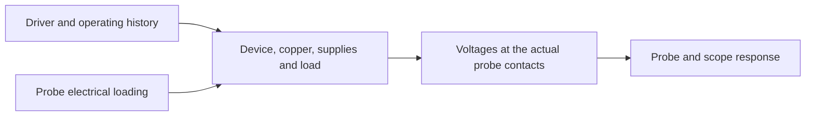

# EPC90133: questioning the method from first principles

1 October 2026. Frozen waveform evidence through test 8; repository HEAD at the
start of this investigation was `555ebcc`. A concurrent, uncommitted full-R change
in `scripts/epc90133_switching.py` was observed and left untouched. This review
does not certify that change. No field-solver or LTspice jobs were launched.

Calculations: `scripts/epc90133_first_principles.py` produces
`results/gan/epc90133-first-principles.json` from hash-bound saved reports. These
are analytical scale checks, not a newly fitted transistor or board model.

## 1. What is the actual prediction problem?

The observable is not an abstract switch-node voltage. It is the output of a
measurement connected between two physical locations, on a particular populated
board, under a particular operating history. A meaningful forward model has to
represent four linked objects:

Our computed observable is the voltage between Q2 pad terminals, with a subsequent
Gaussian filter. EPC's probe locations and response are unknown. Our board's J33,
J2 and capacitor-pad pickup points are different locations again. No amount of
accuracy at one pair of terminals proves agreement at another pair.

There are also three distinct VGS quantities: voltage at probe contacts, at the
vendor subcircuit terminals, and across its internal channel-control nodes. The
current terminal diagnostics do not measure the last quantity. A threshold or a
DC current-versus-voltage relation cannot bridge these distinctions during a
transient without accounting for intervening impedance and displacement current.

First implication: this is currently a comparison of incompletely specified
systems, not an identified error budget for a known experimental setup.

## 2. Separate excitation, modes and observation

After a transition, a locally linearized circuit can be described schematically by

    E dx/dt = A x + B u,       y = C x + D u.

The circuit poles govern oscillation and decay. The state at the end of commutation
and the forcing u govern how strongly those modes are excited. Probe location and
response govern how much of each mode appears in y. In this board the MOS channel,
gate feedback and nonlinear capacitances mean the linearization is local, not valid
through the whole large-signal edge.

Consequently, matching frequency and rise time does not identify package source
inductance. In the simplest RLC example, scaling L -> kL, C -> C/k, R -> kR preserves
frequency and damping. The peak still depends on initial current/voltage and where
it is observed. Extra circuit constraints can break that ambiguity; one VSW trace
alone generally cannot.

Our split gate controls identify a change in the forward simulation when an entire
gate path changes. They do not isolate magnetic coupling from driver impedance,
gate feedback, initial state or the altered energy injected during commutation.
One physical mechanism can change both excitation and decay; these are not
necessarily separate components to be added to the model.

## 3. How large is the unexplained damping?

For the fitted waveform A exp(-alpha t) cos(omega_d t + phi), alpha = 1/tau. A
hypothetical series RLC mode has R = 2 alpha L and
C = 1/[L(omega_d^2 + alpha^2)]. The existing reported damping ratio is alpha/omega_d;
the exact ratio is alpha/sqrt(omega_d^2 + alpha^2). The distinction is under 0.3%
here and cannot explain the discrepancy.

Using the frozen G+50 pH comparison:

| Quantity | EPC raster fit | Simulation fit |
|---|---:|---:|
| Frequency | 264.00 MHz | 261.82 MHz |
| Decay time | 7.83 ns | 24.26 ns |
| Amplitude remaining after one cycle | 0.617 | 0.854 |
| Squared-envelope remaining after one cycle | 0.380 | 0.730 |

The last row is a modal-energy proxy in the single linear mode, not a measurement
of total energy dissipated in EPC's board.

If modal L is taken as 0.257 nH (the diagnostic board loop), the equivalent R gap
is 44.5 mOhm. If two assumed 50 pH sources are added, it is 61.8 mOhm. Neither L
choice has been established as the actual modal inductance: these are scale checks,
not bounds or resistor values to fit. Effective C would be roughly 1.0-1.4 nF.

The dropped resistance terms changed the diagnostic copper loop by about 1 mOhm:
only 1.6-2.2% of those illustrative damping gaps. This revises the practical weight
of the preceding audit: full-R transfer should be correct, but expecting that
correction alone to make the waveforms agree is not supported. It could still
change excitation through the gate paths, which this one-mode calculation excludes.

## 4. Can extra damping alone halve the first peak?

For a free series RLC with initial inductor current I0 and zero capacitor-voltage
perturbation, the first capacitor-voltage peak is

    Vpk = I0 sqrt(L/C) exp[-r atan(1/r)],   r = alpha/omega_d.

Keeping the initial current and characteristic impedance fixed, replacing the
simulation's damping with the measured damping gives a peak ratio of **0.927**.
The actual overshoot ratio is **0.505** (5.70/11.28 V). In this restricted model,
changing damping alone is much too weak: approximately another factor of 0.55 in
excitation or observation is needed. The real edge has forcing and nonlinear C,
so these factors are not a physical parameter identification.

This explains why adding capacitor ESR could improve decay without fixing the
first peak. The next diagnostic should distinguish wrong excitation from wrong
ring dynamics, not keep searching for a scalar loop L or a single arbitrary loss.

## 5. What does the driver omit physically?

A gate driver exchanges charge and energy with supply reservoirs. Our ideal
floating high-side source eliminates bootstrap droop, recharge dynamics and supply
path impedance. The board record has C81 = 100 nF. A 23 nC gate-charge scale gives
Q/C = 0.23 V, about 5% of a 5 V drive, before accounting for recharge, effective
capacitance, quiescent current and other charge paths. This is not a predicted
droop; it shows that an ideal supply is an assumption requiring evidence.

The actual driver specifies resistance at a finite test current, edge times into
one capacitor, and separate timing constraints. Fitting a ramped voltage source
to that capacitor load does not identify the output stage under nonlinear Miller
loading or reverse current. Test 8 changes both capacitance and clamp topology;
it does not isolate finite switching speed. Its clamp rails are still ideal.
The output-stage commutation and its supply circuit should be tested in a small
bench before relying on pin stress from the whole-board model. Reference:
[uP1966E datasheet](https://epc-co.com/epc/Portals/0/epc/documents/datasheets/uP1966E_datasheet.pdf),
already pinned in the project source manifest.

The forward gate path extracted in G is also not the entire physical supply-current
loop: BOOT/VCC, decoupling contacts and their copper are omitted. A small return-side
transfer inductance does not establish a small total feedback voltage. Closing a
loop at an ideal local supply changes where current returns and which magnetic
couplings can act on it.

## 6. Follow energy and charge, not just extrema

For a constant extracted inductance matrix, magnetic energy is W_L = i^T L i / 2
and resistive power is i^T R i. A full-R implementation can have individual
controlled sources delivering power while the complete network remains passive;
the total quadratic form, not each source's sign, is the relevant check.

For a nonlinear two-terminal charge element, stored energy is integral(v dQ),
not generally C(v) v^2 / 2. A static, single-valued charge law does not by itself
model hysteretic loss (the closed-cycle integral of v dQ). Series resistance and
the transistor channel can still dissipate energy; the vendor model is not wholly
lossless. Adding an arbitrary "Coss resistor" is not equivalent to identifying
the missing device loss.

A useful next diagnostic revision should save enough quantities to distinguish:

- energy supplied by each ideal driver and bus source;
- changes in magnetic and charge-storage energy;
- resistive and channel dissipation;
- Q2 channel current separately from terminal charging current;
- energy-balance residual and its timestep dependence.

This may show an excitation problem or missing damping, or merely diagnose a
numerical artefact. Passing energy balance establishes internal numerical
consistency, not fidelity to a physical board. Keep the vendor model unmodified.

## 7. The surrounding circuit is part of the high-frequency problem

The load is represented as an ideal 2.2 uH inductor terminating into an ideal
13.8 V source. That fixes the slow current ramp, but it does not establish the
load branch impedance near 264 MHz: winding capacitance, mounting geometry and
loss are absent. The inductor and output capacitor are user-fitted parts in the
schematic record. Their identity in EPC's measurement is an open boundary condition.
An assumed ideal load cannot validate the actual test fixture's high-frequency
return path. This is a candidate, not evidence that it dominates.

Likewise, one 100 MHz R/L extraction is a single-frequency approximation, even
if its matrix is transferred exactly. Shape, port contacts, source-pin shorts,
window boundaries, via representation and omitted copper all define the reduced
network. Mesh connectivity and positive-definite L do not establish geometric
accuracy. [FastHenry's guide](https://www.fastfieldsolvers.com/Download/FastHenry_User_Guide.pdf)
explicitly distinguishes single-frequency equivalents from broadband models.
Conversely, these limitations do not automatically justify full-wave simulation
or a much larger mesh. First demonstrate a decision-sensitive error.

## 8. Observation errors are not all bandwidth errors

A non-loading linear filter cannot generally replace a circuit's natural pole
with a different one; after filter transients, a surviving exponential mode
retains its decay rate. Finite-window fitting, multiple modes and cancellation
can complicate this. A real probe can also load the circuit and change its poles.
That is distinct from the current Gaussian post-processing.

At 264 MHz, the assumed 350 MHz Gaussian response has gain 0.821. This by itself
does not explain an overshoot ratio near 0.505, nor the decay-time ratio. Rescaling
the digitized voltage swing to 48 V raises the measured overshoot only from 5.70
to 5.97 V. These scale checks make simple bandwidth or voltage-calibration fixes
weak candidates; they do not exclude probe resonances, location or loading.
[EPC/Tektronix's measurement note](https://www.tek.com/en/documents/application-note/accurately-measuring-high-speed-gan-transistors)
demonstrates that connection geometry and probe capacitance affect measured GaN
waveforms. A known probe at a declared contact pair is an essential model input.

## 9. A more discriminating next experiment

Do not begin with another search for a parameter set that resembles Fig. 9.
First divide the forward problem into tests with distinct questions:

1. **Network transfer:** qualify the in-progress full-R revision against complete
   terminal Z, including simultaneous port currents and reference changes. This is
   a correctness gate, with a modest expected damping effect under the scale check.
2. **Ring dynamics:** use a bounded small-signal or controlled ring-down diagnostic
   about the post-transition operating state. Compare gate-clamped and active-driver
   cases separately; clamping gates changes feedback, so it is a control, not the
   same circuit. Examine poles, terminal participation and dissipative paths.
3. **Excitation:** with the ring network fixed, inspect driver/gate charge, actual
   channel currents and source energy during the switching edge. Use internal model
   quantities as diagnostics, not as physically accessible probe voltages.
4. **Observation:** predict the actual chosen pickup points and probe loading when
   the equipment and board are known. Characterize connection response before using
   waveform differences to tune any device parameter.
5. **Identification:** select a few held-out operating conditions where competing
   models give different predictions. Do not turn every sensitivity case into an
   additional fitting parameter or infer confidence from the best-fitting case.

These are proposed, bounded diagnostics, not authorized long-running sweeps in
this review. The experimental priority remains known equipment and a characterized
measurement setup. G3 stays open. A more elaborate simulation without independent
constraints could become a better fit and a worse explanation.
