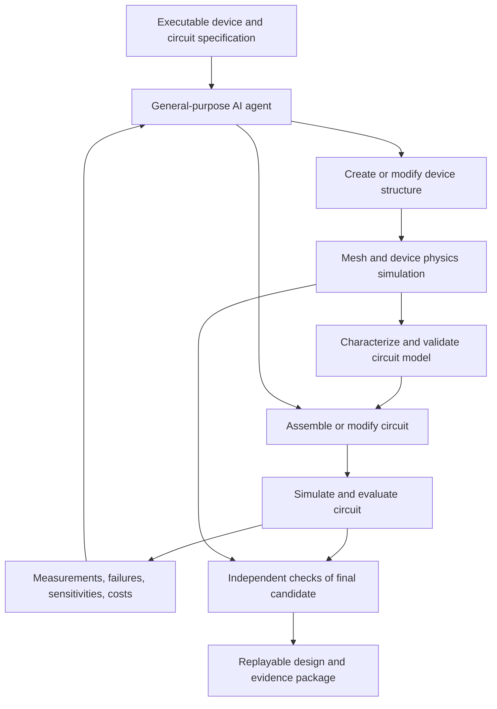

# An agent toolset for semiconductor-device and circuit co-design

> **Superseded as the implementation priority on 28 September 2026** by the
> [GaN half-bridge pipeline plan](gan-halfbridge-pipeline-plan.md). The
> contracts in sections 3–6 (state, identity, result semantics, evidence,
> execution) still apply. The NMOS/amplifier demonstration and the IRDS
> comparison are paused fixtures.

## Priority correction: GaN application and simulator choice

The project owner clarified that GaN has been the intended application target;
the silicon NMOS work was an assistant-selected tool-development fixture.
Preserve the generated NMOS and executed results, but completion of the NMOS
amplifier is not a prerequisite for the GaN project. This correction supersedes
the first-demonstration ordering in the older sections below.

The active application is a commercial GaN FET and half-bridge reference board:
establish the vendor model/reference-circuit baseline, incorporate layout and
parasitics, and compare with approved physical measurements. Choose the
simulator using the selected vendor model, automation support and available
licenses. LTspice, PSpice and Spectre are candidates alongside ngspice; extend
the runner interface for the chosen engine rather than treating ngspice
compatibility as a gate. The immediate selection step is to identify the exact
EPC device/board and demonstrate a vendor-model test bench in a supported
simulator. Existing NMOS and circuit tooling remain reusable development work.

11 September 2026. Active project direction. Implementation started 14 September 2026: the Python core/CLI, ngspice fixtures, diode fitting fixture, and official DEVSIM diode/MOS reference executions are available. See [build status](../docs/build.md). The complete co-design demonstration and release gates below remain unfinished; descriptions of the starting point are historical.

16 September 2026 checkpoint: diode local-refinement and 2D resistor
current-normalization checks pass. The fourth uniform planar-MOS mesh brings
the last drain-current change to 0.184%, below the fixed 1% endpoint tolerance.
Local-refinement attempts were rejected; the successful uniform run uses a
pinned local OpenBLAS runtime, cross-checked on an identical mesh. Proceed to
NMOS DC characterization and bias-domain/slope qualification before accepting
model-bridge evidence. The first nine-point 300 K DC grid completed with a
predeclared six-point training set and three-point held-out gate slice;
the level-2/3 comparison now passes at all nine biases and for six finite-span
secants (maximum drain-current change 0.1872%). Central secants also pass a
three-step bias-spacing check on level 2. Smaller-stencil mesh accuracy and
continuous-domain accuracy remain unresolved. The baseline gm/gds ratio near
0.063 suggests revisiting physical geometry or operating bias before targeting
amplifier gain. Infineon CoolGaN is recorded as a
candidate commercial reference track in the benchmark notes; it does not
replace the active custom planar-NMOS milestone.

28 September 2026 checkpoint: the upstream MOS example is retired as the
amplifier candidate (weak gate control, gm/gds ≈ 0.063 on the sampled grid)
and kept as a numerical regression fixture. Backlog item 5 has started: a
planar NMOS (`devices/planar-nmos-lc1.json`) is generated from one
specification with DEVSIM's internal mesher, swept, and given a mesh-checked
common-source operating point (estimated Av ≈ −11). The detailed IRDS
comparison below is deferred until the loop through a fitted model and
ngspice amplifier works; basic electrostatics set this device revision.

## 1. Objective and priorities

### Near-term decision: focused IRDS comparison

Added 28 September 2026 at the project owner's request. Use the International
Roadmap for Devices and Systems (IRDS) to choose meaningful device targets
and guide the next physical-device revision toward the amplifier demonstration.
Keep this a bounded design input; the working device-to-amplifier loop remains
the main milestone.

1. Select and record one relevant device class, roadmap edition, target year,
   and exact source table/row. Start from the
   [IEEE IRDS editions index](https://irds.ieee.org/editions/) and inspect the
   applicable chapter. The inspected
   [2024 More Moore chapter](https://irds.ieee.org/images/files/pdf/2024/2024IRDS_MM.pdf)
   includes logic and analog specifications; it is a starting source, not a
   claim that the latest edition or final comparison profile has been selected.
2. Produce a compact comparison table with: metric, roadmap target, our result,
   units, device architecture/dimensions, bias and temperature conditions,
   extraction method, evidence status, and remaining gap. Match current-width
   normalization explicitly. Mark incompatible definitions or device classes
   as not directly comparable rather than reporting a misleading ratio.
3. Initially consider structure/dimensions, operating voltage, on/off currents,
   threshold voltage, subthreshold slope, and relevant analog quantities such
   as gm, gds and gm/gds. Our current narrow DC grid supports local current and
   secant diagnostics only; standardized on/off and threshold/subthreshold
   extraction still require suitable sweeps. Add capacitance, speed and energy
   comparisons only when their required models and evidence exist.
4. Use the relevant gaps to select a concrete geometry, doping or operating-bias
   change, then evaluate its effect on amplifier gain, power and operating
   range. The present reference-device gm/gds near 0.063 motivates this decision;
   it is not an IRDS performance ranking under matched conditions.

Deliverable: a short, sourced comparison and a justified next device-design
experiment. Roadmap projections are engineering targets, not measured-device
ground truth or validation of our simulator. Preserve the distinctions between
numerical verification, roadmap comparison, model-fit validation and physical
device validation described in the benchmark notes.

### Core objective

Build a reusable engineering environment that a capable general-purpose AI agent can use to **design semiconductor devices, connect them into circuits, simulate both levels, inspect failures, and iterate toward an executable specification**. Custom semiconductor-device design and circuit co-design are in scope from the first working demonstration, as requested by the project owner.

The deliverable is an installable toolset, documented interfaces, validated reference examples, and replayable design experiments. The agent supplies strategy and reasoning; the toolset supplies engineering operations and evidence. Its usefulness should improve when a better agent becomes available without requiring the engineering stack to be rewritten or an in-house language model to be trained.

Priority order:

1. Working device-to-circuit operations and trustworthy feedback.
2. A complete autonomous co-design loop on a bounded problem.
3. Reliable reuse across tasks and agent clients.
4. Broader device physics, circuit classes, and physical implementation.
5. Research studies of which tools, models, and search policies improve outcomes.

This plan supersedes the implementation priority in the earlier `FINAL-PLAN.md`. Its fidelity/ranking experiment becomes an optional consumer of the toolset. Its fixed topologies, 29 corners, 250-draw endpoint, model roster, and resource estimates are not defaults for this new programme. The old plan, protocol and pilot results are preserved in git history at commit `79b80fa`.

## 2. Starting point and scope

The repository currently contains plans, a paper collection, numerical protocol/budget checks, and an input-presence checker. The recorded pilot preflight (`results/pilot/preflight.json`, now in git history) reported missing simulator/PDK/reference inputs and zero circuit simulations. No TCAD adapter, device model bridge, circuit editor, simulation service, or autonomous design loop is implemented here. That recorded preflight concerns the old pilot; the new stack needs its own environment check.

Three operations must have distinct representations and validation:

| Operation | What the agent changes | What establishes its meaning |
|---|---|---|
| Physical device design | Geometry, regions, contacts, doping, and later supported material/process parameters | A regenerated device structure and mesh, declared physics, and new device simulations |
| Compact-model construction | Parameters or functional representation fitted to device/measurement data | Held-out agreement, valid operating domain, numerical behavior, and supported analysis types |
| Circuit design | Device instances, connections, passive values, biasing, hierarchy, and supported layout constraints | Circuit checks and measurements under a fixed specification |

Changing a free compact-model parameter is not evidence of a realizable physical device change. A custom simulated transistor is not automatically a device available in SKY130 or any other foundry process. Keep exploratory device technology and foundry-qualified primitives as separate technology records.

**Recommended first family:** a reproducible 2D planar silicon NMOS, paired with a resistively loaded common-source amplifier. This is a proposed engineering starting point, not an inferred preference for silicon over the device families in the paper collection. It keeps the physical model and circuit small enough to diagnose. A PN diode is the initial physics/bridge fixture. GaN HEMT, ferroelectric, ReRAM, and other emerging-device families enter through their own calibrated physics packages.

Device simulation starts from explicitly defined structures. Fabrication-process simulation, arbitrary material discovery, and production manufacturability require additional validated backends and process data; they are separate extensions.

## 3. The system we should build



Implement a Python engineering library first, with a command-line interface for reproduction and a thin MCP interface for agent access. All three use the same operations, identifiers, and validation. MCP is an access mechanism, not the research contribution. It supports typed input and output schemas; adopt a pinned compatible protocol/SDK version after testing the intended clients. [MCP tool specification](https://modelcontextprotocol.io/specification/2025-11-25/server/tools)

Start with one agent and a durable job runner. The agent can delegate independent characterization or candidate evaluations, but a fixed multi-agent cast is not a prerequisite. Optimizers, fitting routines, and sweep scheduling execute in ordinary code rather than consuming one model call per numerical step.

Use three cooperating layers:

| Layer | Responsibility |
|---|---|
| Engineering core | Device/circuit representations, transformations, units, model domains, tests, measurements, and provenance |
| Execution adapters | DEVSIM, ngspice, model compiler, and later characterization/layout/commercial tools; capability and compatibility reports |
| Agent access and experiment harness | Discoverable operations, compact observations, plots on demand, budgets, replay, and comparative evaluation |

Keep the initial state store small: immutable files plus a local SQLite index and a bounded worker queue. Add distributed scheduling when measured workloads justify it. Every artifact records its parents. Old characterization/model artifacts remain evidence for their original device revision; a changed device requires new evidence before dependent circuit results can be accepted.

## 4. Reuse before writing adapters

Spend the first implementation spike running the same small fixtures through candidates below. Inspect licenses, pin source/runtime versions, and record compatibility and missing capabilities. These are documented upstream capabilities, not tools already validated locally.

| Candidate | Reuse opportunity | Adoption decision |
|---|---|---|
| [DEVSIM](https://github.com/devsim/devsim) | Python-scriptable semiconductor PDE solver; supplied diode and MOS examples | First device backend. Reproduce the selected physics/mesh example before exposing design knobs |
| [ngspice](https://ngspice.sourceforge.io/) | Circuit solution engine | First circuit backend; keep a direct batch reference run for checking any wrapper |
| [SpiceXplorer](https://github.com/MacAnalog/spicexplorer-release) | Circuit graph, measurements/units, optimizer, model bindings, and layout/verification packages | First circuit-library reuse candidate. Test its independently usable packages and custom-device path before building overlapping infrastructure |
| [ltspice-mcp](https://github.com/cognitohazard/ltspice-mcp) | Existing structured simulation, measurements, job control, operating-point inspection, and LTspice schematic operations | Evaluate its ngspice path as an adapter candidate. Verify custom-model loading and IC instance naming; do not require LTspice for the core flow |
| [mcp-spice](https://github.com/Casys-AI/mcp-spice) | Bounded ngspice execution and durable results tied to exact circuit inputs | Compare execution/provenance design; its documented scope is narrower than the full co-design toolset |
| [Hdl21](https://github.com/dan-fritchman/Hdl21) | Circuit modules, ports, external device models, and netlist export through VLSIR | Evaluate as the circuit representation/export layer; support the chosen custom device before committing |
| [OpenVAF](https://openvaf.github.io/docs/getting-started/usage/) | Compile supported Verilog-A models for OSDI-capable simulators | Preferred custom-model path, subject to an actual compiler/ngspice compatibility test |
| [CACE](https://github.com/efabless/cace) | Executable characterization configurations and simulation orchestration | Reuse appropriate characterization conventions/components once the small loop works |
| [Analog chip design agents](https://github.com/hdl-tools/analog-chip-design-agents) | Broad domain workflows and existing tool integration work | Review relevant adapters and task instructions; upstream breadth alone does not establish our device-to-circuit validation |

Adopt a usable existing wrapper when it passes our fixtures. If custom-device loading, identity, or measurements require extensive workarounds, implement a small direct ngspice batch adapter behind the same interface. Record that decision once; avoid supporting several circuit engines in the first release.

Timebox this comparison: inspect SpiceXplorer's relevant leaf packages and one ngspice MCP wrapper first. Hdl21 and the other wrappers are alternatives if the needed representation or execution contract is missing, not additional mandatory dependencies. Select one circuit representation and one execution path for the first release.

The project-specific work should concentrate on the **physical-device/circuit-model handoff, validity-aware operations, joint design state, independent verification, and evidence about tool usefulness**. Existing SPICE wrappers make a generic simulation MCP server an insufficient differentiator.

## 5. Agent-facing operations

These are proposed logical operations, not an implemented API. Expose only supported operations in capability discovery. Keep schemas narrow, show working examples, and permit batches of independent edits or simulations.

| Capability | Proposed operations | Inputs and useful outputs |
|---|---|---|
| Discovery | `catalog.search`, `catalog.inspect` | Find device families, physics profiles, models, circuits, tests, and tools; return terminals, legal knobs, units, provenance, and limitations |
| Specification | `spec.create`, `spec.inspect` | Device/circuit objectives, thresholds, environments, legal actions, required evidence, and resource limits; return versioned spec ID |
| Device construction | `device.create`, `device.patch`, `device.inspect` | Template or explicit supported structure; typed geometry/doping/contact edits; return revision, geometry preview, structural checks, and changed dependencies |
| Mesh construction | `device.mesh` | Device revision and mesh policy; regenerate mesh and material/contact mapping; return mesh identity, dimension checks, and refinement diagnostics |
| Device experiments | `device.simulate` | Device revision, mesh/physics profile, bias/temperature sweeps, requested observables; return job ID and estimate, then currents, charge where supported, fields, convergence and mesh diagnostics |
| Model bridge | `model.fit`, `model.validate`, `model.export` | Characterization dataset, model family, fit/holdout split and tolerances; return coefficients/source, validation evidence, supported analyses, domain, and compiled model identity |
| Circuit construction | `circuit.create`, `circuit.patch`, `circuit.inspect` | Instances, named terminals/nets, values, model references; add/remove/rewire/resize; return revision, netlist, connectivity view and semantic diff |
| Circuit checks | `circuit.check` | Circuit revision and technology/spec context; return missing models, invalid pins, illegal values, suspicious connectivity, and supported-analysis violations |
| Circuit experiments | `circuit.simulate` | Circuit revision and experiment definition; OP/DC first, AC/transient after model validation, noise when a noise model exists; return durable run handles |
| Interpretation | `results.inspect`, `results.compare` | Runs, signals, intervals and measurement recipes; return quantities with units, trace references, limiting constraints, before/after changes, and requested plots |
| Numerical assistance | `analysis.sensitivity`, `search.run` | Legal design variables, objective and bounded method; return realized perturbations, local response estimates or candidate batches, with all execution costs |
| Verification | `verification.run` | Frozen candidate/spec and named verification profile; independently assemble evaluation jobs and return pass/fail/unresolved/not-supported per requirement |
| Job and artifact lifecycle | `jobs.get`, `jobs.cancel`, `artifacts.export` | Durable IDs; report progress, partial results, cancellation, and a replay package |

For the first slice, sensitivity/search can be SDK routines and the agent can choose candidates directly. They become MCP operations only when usage demonstrates their value. Core construction, simulation, model validation, results, verification, and job operations must be usable without an autonomous orchestration framework.

Circuit patches must support connecting a named terminal to a named net and changing topology. A toolset restricted to changing a list of transistor widths would not satisfy the intended scope. Start with small circuits and declared supported primitives; arbitrary graph generation is not required for the first demonstration.

An agent may propose new testbenches, measurements, model implementations, or backend scripts when existing operations are insufficient. Execute them through the same recorded job mechanism. New measurements need known-answer/reference checks before they become certification recipes. Changes to a benchmark's fixed evaluator or physics profile create a new experiment version.

## 6. Common contracts that make the tools dependable

**State and identity.** Store separate `DeviceDesign`, `PhysicsProfile`, `CharacterizationDataset`, `CircuitModel`, `CircuitDesign`, `Specification`, `Experiment`, and `Result` objects. Revisions are immutable. Patches declare the revision they expect; concurrent stale edits fail rather than overwrite another agent's work. Preserve terminal names, current/charge sign conventions, coordinate units, and device-instance identities throughout.

**Model validity.** A circuit model declares the specific physical design or validated family, bias/temperature/geometry domain, supported physics and analyses, fitting source, and validation results. The first bridge may be valid only for one physical device revision. Changing oxide thickness or doping triggers new characterization and model validation; it does not silently reuse an old fitted model. Interpolation across device designs is a later validated acceleration.

**Result semantics.** Keep job state separate from engineering outcome. Jobs are queued/running/completed/failed/cancelled. Requirement outcomes are pass/fail/unresolved/not-supported/not-run. Distinguish invalid geometry, missing model, mesh failure, nonlinear nonconvergence, invalid measurement, model-domain violation, and measured specification failure. An exit code of zero is insufficient evidence of success, and a timeout is not a physical infeasibility result.

**Evidence.** Each reported scalar has value, unit, definition, analysis context, validity status, and a pointer to source data. Include device/model/netlist/testbench/physics/tool hashes, mesh settings, solver options, random seeds when applicable, retries, and actual CPU/wall/memory usage. Summarize for the agent; retain full logs, sweeps and field/waveform data for inspection.

**Execution.** Return a job ID for long operations, with polling, cancellation and restart recovery. Enforce job limits and concurrency outside the agent. Retries follow a recorded bounded policy; report which numerical settings changed. Normal authorized design iterations proceed automatically within the experiment budget.

**Caching.** Key on all effective inputs, including model source and compiled binary, device structure, mesh, physics, simulator/version/options, environment, and testbench. Repeated stochastic checks need distinct seeds/sample IDs; a cached run does not count as a new independent observation.

**Data.** Use JSON for manifests and scalar summaries, an appropriate array format for curves/fields, standard SPICE/Verilog-A for model exchange, and generated geometry/connectivity/waveform previews. Keep units explicit at every boundary, particularly DEVSIM geometry/doping conventions and 2D out-of-plane current/charge normalization.

## 7. First complete demonstration: custom NMOS and amplifier

The first user-facing task should be: **within a declared planar NMOS family, jointly choose device geometry/doping and a connected amplifier circuit to meet DC transfer, gain, and power constraints, then independently check the result.** The deliverable is the structure, model, circuit, evidence, and replay command.

### Reference and design space

Start from the official [2D MOS simulation](https://github.com/devsim/devsim/blob/main/examples/mobility/gmsh_mos2d.py) and its associated structure/mesh files. Reproduce the original example before parameterizing it. Its existence is a starting point, not proof that our proposed variations or extracted models are reliable.

Generate the Gmsh geometry, mesh, and doping assignments from one canonical device specification. The upstream construction script imports an existing mesh and duplicates some geometry parameters; changing a Python parameter alone does not establish a new physical geometry. Verify the resulting dimensions, contacts and material regions. In this cross-section, the upstream `gate_width` names a lateral dimension, not the out-of-plane transistor width. [Reference construction script](https://github.com/devsim/devsim/blob/main/examples/mobility/gmsh_mos2d_create.py)

Begin with an isothermal 300 K research model and body tied to source. The example physics is not a calibrated fabrication process; its simple material implementation includes incomplete temperature dependencies. Temperature variation and more advanced transport need separate validation before they become supported design conditions. [Reference physics](https://github.com/devsim/devsim/blob/main/python_packages/simple_physics.py)

Expose a small set of physically meaningful knobs: gate length, oxide thickness, and channel doping, where the reproduced template supports them. Fix materials and the transport/recombination profile for the benchmark. Put bounds, units, and geometry dependencies in the device manifest; derive defensible ranges from the selected reference. Width/out-of-plane scaling must have one explicit definition and must not be counted twice between the device and circuit models.

In the circuit, expose drain resistance and gate bias, and permit the agent to assemble the source/body/drain/gate connections and perform a small legal topology repair. Supply, load context, evaluation range, and target constraints remain fixed per task. Use a source-degenerated variant as a subsequent topology task once the base circuit is reproduced.

### Closed loop

1. Reproduce a PN-diode fixture and the selected NMOS reference with mesh and solver checks. Produce a baseline circuit whose evaluation is repeatable.
2. Create a revised device structure, regenerate the mesh, and collect DC current curves over a bias domain covering the intended circuit operation. Split fitting and validation points before fitting.
3. Fit a bounded smooth DC model and export it to SPICE. The preferred customizable route is Verilog-A/OSDI; compare a small constrained analytical MOS fit before adding a learned model. Select the simplest representation that passes the declared tests.
4. Validate held-out terminal currents and relevant local slopes. Check continuity, current conservation, body bias assumptions, and nonlinear solver behavior. A DC-only model must advertise that restriction.
5. Assemble the amplifier and measure bias, static transfer, low-frequency gain derived from the DC transfer slope, and power. Inspect failing constraints and any model-domain excursions.
6. Revise a physical device knob and a circuit choice using the observed circuit tradeoff. Refit/revalidate whenever the physical design changes. Record rejected candidates as well as improvements.
7. Freeze the candidate and independently recheck it. Refine the optimized device's mesh and solver settings under a declared validation policy; require stable circuit quantities within registered tolerances or return unresolved. For the resistor-loaded circuit, solve its load-line relation using direct TCAD current evaluations at fresh operating points; compare output voltage, power and DC gain against the compact-model circuit. This provides a small reference check without presuming a general mixed-mode TCAD/SPICE co-simulator.
8. Export all input revisions, data, fitted source, netlist, test definitions, diagnostics, final outcome and replay instructions.

**Acceptance gate:** an agent starting from the documented tools can build/connect the circuit, make a real geometry or doping change, run the full device-to-circuit loop, respond to a failure, and produce a replayable final evaluation. At least one task must attain its fixed specification; success claims across a task family require the later benchmark. Independent checks must agree within tolerances set before evaluating optimized candidates. A partial run or diode-only fixture is reported as such and does not complete this milestone.

Use relative-plus-absolute current errors, especially near zero, rather than percentage errors alone. Register separate tolerances for current, local slope, output voltage and circuit constraints after reference characterization and before optimization. Do not invent empirical accuracy or use a single global RMSE as an acceptance test.

Explicitly check returned convergence flags, residuals and missing bias points. DEVSIM's informational solve mode can return a failed-convergence result without throwing an exception. The runner must not interpret that as valid training or verification data. [Solver documentation](https://devsim.net/solver.html)

### Dynamic co-design is the next required release

Extend characterization and models to terminal charge and small-signal behavior. Validate charge/current conservation, derivatives/capacitances, smoothness, held-out bias points and any newly supported temperature points, and circuit convergence. Then add frequency response and transient settling/distortion tasks with suitable reference device/circuit checks. Noise requires a validated noise description; self-heating, traps, and hysteresis require explicit state/physics support. A DC fit alone cannot establish any of these capabilities.

During transient verification, inspect whether the device trajectory leaves the validated domain. Domain failure should request more characterization or reject the evidence, rather than extrapolate silently. The same principle applies when optimizing a device that looks favorable only because the fitted model is inaccurate near a boundary.

## 8. Implementation sequence and release gates

Effort ranges below are initial planning allowances in focused engineer-weeks, not measured runtime or delivery promises. Re-estimate after the reference spike; part-time work and unfamiliar device physics can substantially extend calendar time. The custom-device path is on the critical path from the beginning.

| Phase | Work and deliverable | Gate | Initial allowance |
|---|---|---|---|
| A. Reference and reuse spike | Pin Linux environment; compare wrappers; reproduce diode, planar NMOS, custom-model loading, and a simple SPICE circuit | Source/physics/mesh provenance; stable reference observations; explicit adoption decisions | 1-2 weeks |
| B. Working co-design slice | Device revisions, DC characterization, fit/validate/export, circuit assembly, measurements, job/results contracts; enforced model domains, fixed evaluator and direct-TCAD final check | Complete demonstration in section 7; no manual edits hidden inside the agent run | 3-5 additional weeks |
| C. Reusable agent release | Package SDK/CLI/MCP, examples, resumable jobs, harden domain/evaluator enforcement, failure fixtures, first comparative task suite | Another session/client can operate and replay the tools; faults and unsupported analyses are handled correctly | 2-3 additional weeks |
| D. Dynamic device/circuit release | Charge-aware model bridge, AC/transient validation and circuit tasks | Dynamic evidence passes its own tests; held-out final checks detect model exploitation | 3-6 additional weeks |
| E. One application family | Select a research-relevant device with usable data/physics; connect it to an application circuit | A complete second family workflow with independent calibration/reference evidence | Scope after A-D |
| F. Physical implementation and robustness | One compatible PDK/layout flow, extraction and bounded variation analyses | Traceable schematic/layout/model correspondence and qualified verification profile | Scope after compatibility reproduction |

The first milestone should not wait for full analog layout automation, a large neural dataset, or language-model training. Equally, an OTA-only sizing demonstration does not substitute for the requested custom-device loop.

At each gate, keep the usable release even if a later backend fails. If a selected physics package cannot be reproduced, record the missing physics/data or numerical barrier and address it before claiming support. Do not substitute an easier family while retaining the harder family's headline.

### First implementation backlog

1. Add a new toolset environment manifest and preflight independent of the legacy pilot. Pin the Python runtime, DEVSIM reference, ngspice and model-compiler combination, and mesh generator if required.
2. Reproduce the diode and planar-MOS references; document contacts, normalization, valid bias range, solver settings and mesh sensitivity.
3. Run a custom Verilog-A/OSDI model in a known-answer circuit; compare direct batch execution with the preferred wrapper.
4. Define the device, model, circuit, spec and result schemas around those real files. Implement content-complete identities and a minimal runner.
5. Parameterize the NMOS structure and build the DC characterization/holdout pipeline.
6. Build the fit/export/validation bridge and the direct-TCAD load-line checker.
7. Add circuit create/connect/patch and deterministic measurement operations. Reproduce the amplifier baseline.
8. Expose the working operations to an agent and execute one bounded co-design task with full evidence.
9. Add restart/fault fixtures, package the example, and run the first same-agent comparison against direct scripts.

Suggested future repository layout, to be created during implementation:

```text
src/circuit_tools/       # common library and CLI
  core/                 # objects, units, revision/dependency tracking
  adapters/             # device, circuit, compiler, later layout engines
  operations/           # engineering operations shared by API and tools
  server/               # MCP exposure
devices/                # reference structures and validated physics packages
models/                 # model source, domain and validation manifests
circuits/               # reference circuits and executable specifications
examples/               # diode fixture and NMOS/amplifier walkthrough
benchmarks/             # task definitions, frozen evaluators and budgets
tests/                  # known-answer, adapter, fault and replay checks
runs/                   # generated per-run manifests and artifact references
```

## 9. Evaluation: does the toolset make agents better engineers?

Evaluate tool correctness and agent usefulness separately. The first useful result can be a working, reproducible release; a paper needs comparative evidence beyond integration.

| Question | Comparison or check |
|---|---|
| Are individual results correct? | Known-answer circuit/diode fixtures, reference device curves, mesh refinement, independent scalar extraction, and direct-TCAD final checks |
| Does the interface help? | Same agent, same task/data/docs/compute limits: direct scripts/files versus structured operations; account for wrapper conveniences rather than hiding them from the baseline |
| Does joint design help? | Fixed-device circuit optimization versus fixed-circuit device optimization versus joint design, all using the same circuit-level objective and matched total resource budgets; add sequential device-then-circuit optimization as a baseline |
| Which observations matter? | Scalars alone versus diagnostic fields/operating points; agent-facing model-domain assistance on/off; local response tools on/off, where feasible. Final acceptance uses identical domain and verification requirements in every arm |
| Is a learned bridge useful? | Analytical or tabulated baseline versus learned model, evaluated on held-out device/circuit behavior and end-task outcome |
| Can other agents use it? | At least two capable agent configurations through the same contract when accessible; record exact model/client/date/settings |

Start with a small declared development suite: device modification, circuit assembly, wrong-connection repair, convergence diagnosis, out-of-domain model detection, and joint design under a changed specification. Separate fixture engineering from autonomous benchmark runs. Freeze held-out tasks, constraints, evaluation profiles and candidate acceptance rules before measuring comparative success. Do not continually use the final holdout set to tune tools.

Report verified success within budget, failed/unresolved cases, model-domain violations, actual device/circuit solver calls, CPU time, elapsed and queue time, API usage/cost, and human interventions. Include setup and characterization/fitting cost and distinguish cold-cache from warm-cache performance. One TCAD call and one SPICE call do not represent equivalent cost. Record attempts, not just successful trajectories.

Initialize budgets from measurements in phase A. Every job has time/memory limits, every run has a total resource ceiling, and retries count. A first comparison should be small enough to inspect every failure. Increase episodes only after estimating cost and uncertainty from the development run. Do not reuse the old pilot's unmeasured compute estimates for the new stack.

The evaluator owns the fixed testbench, allowed physical models, operating context and thresholds. The agent can explore alternative tests but cannot make a benchmark pass by removing a load, changing a target, weakening physics or editing the final evaluator. Preserve exploration freedom and evaluate the final candidate against the original task.

Potential research contributions are hypotheses to test: whether physical diagnostics improve autonomous repair, whether a validity-aware bridge improves joint design, and which tool abstractions transfer across agents/device families. The original fidelity/ranking studies can be rebuilt on collected tool traces when they answer a demonstrated failure mode. A generic MCP wrapper, existing DTCO, or an agent calling TCAD should not be claimed as new on its own.

## 10. Extensions and boundaries

**Emerging devices.** Choose one family using available measured data, calibrated physics, model source, and an application circuit. A HEMT path needs the relevant transport/thermal behavior; a memory-device path needs state, history and variability where claimed. Reuse the common workflow, but qualify each family's physics and model domain separately.

**Layout and parasitics.** Introduce a reproduced compatible technology/layout pair and adapters for generation, DRC, LVS and extraction. Evaluate ALIGN or a parameterized generator with Magic/netgen as appropriate. Do not promise that a novel TCAD device can be laid out in an existing PDK. A custom-device physical flow requires device recognition, layout generators/rules and extraction models for that process; an open-PDK CMOS circuit containing a modeled external device is a distinct integration scenario.

**Robustness.** Add corners, tolerances and correlated variation only where their distributions/physics have a source. Keep deterministic corner checks, model uncertainty, statistical yield and measured fabrication evidence distinct. Existing exact-interval and unresolved-outcome logic can support named verification profiles; its old sample counts do not carry over automatically.

**Additional solvers and experiments.** Commercial TCAD/SPICE, thermal/EM solvers, mixed-signal engines, and measurement instruments can share the contract once actual access and reference cases exist. Physical hardware wiring, PCB design and lab automation are separate integrations. Simulation connectivity is the initial meaning of connecting circuits here.

## 11. Literature grounding

The local [paper index](../papers/README.md) is a useful catalog, but its earlier broad novelty statements are historical notes, not newly verified conclusions. Use full papers for specific claims and reproduce code before adopting performance claims. New sources found during this planning pass include existing SPICE MCP tools and AgenticTCAD.

- [AgenticTCAD](https://arxiv.org/html/2512.23742v1), sections III-C and IV, already connects structure/code generation, Sentaurus simulations and device-metric optimization. Its reported loop motivates device diagnostics and convergence recovery. The evaluated objective is at device level; our proposed circuit-model handoff and circuit-driven evaluation need separate evidence. This does not establish novelty for the complete project.
- [AnalogCoder](https://arxiv.org/abs/2405.14918) proposes training-free circuit code generation and reusable subcircuit tooling. Reusable composition and simulation feedback are prior art, and useful design patterns for our circuit layer.
- [DEVSIM's published simulator description](https://doi.org/10.21105/joss.03898) and the official reference scripts ground the first device backend. Treat our selected device physics and numerical checks as part of each experiment's model assumptions.

The local-paper review supporting the detailed reuse and model-validation decisions is recorded in the companion [reference notes](autonomous-toolset-reference-notes.md).

## 12. Definition of a useful first release

A new agent session can discover the available device family, create a physical variant, characterize it, obtain a validated circuit model, assemble and modify a circuit, run experiments, interpret failure, and iterate. Its final result includes an independently evaluated outcome and enough files and metadata for another session to reproduce it.

That complete capability is the next implementation objective. Broader autonomy and research claims follow from measured performance on progressively harder device/circuit tasks.
